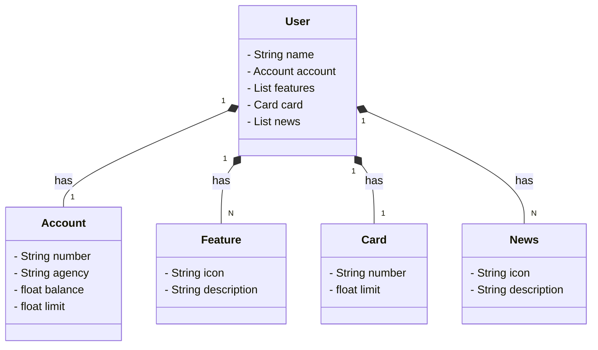

Projeto do zero.
##Diagrama de codigo

```mermaid
classDiagram
    class User {
        - String name
        - Account account
        - List<Feature> features
        - Card card
        - List<News> news
    }
    
    class Account {
        - String number
        - String agency
        - float balance
        - float limit
    }
    
    class Feature {
        - String icon
        - String description
    }
    
    class Card {
        - String number
        - float limit
    }
    
    class News {
        - String icon
        - String description
    }
    
    User "1"*--"1" Account : has
    User "1"*--"N" Feature : has
    User "1"*--"1" Card : has
    User "1"*--"N" News : has
```
